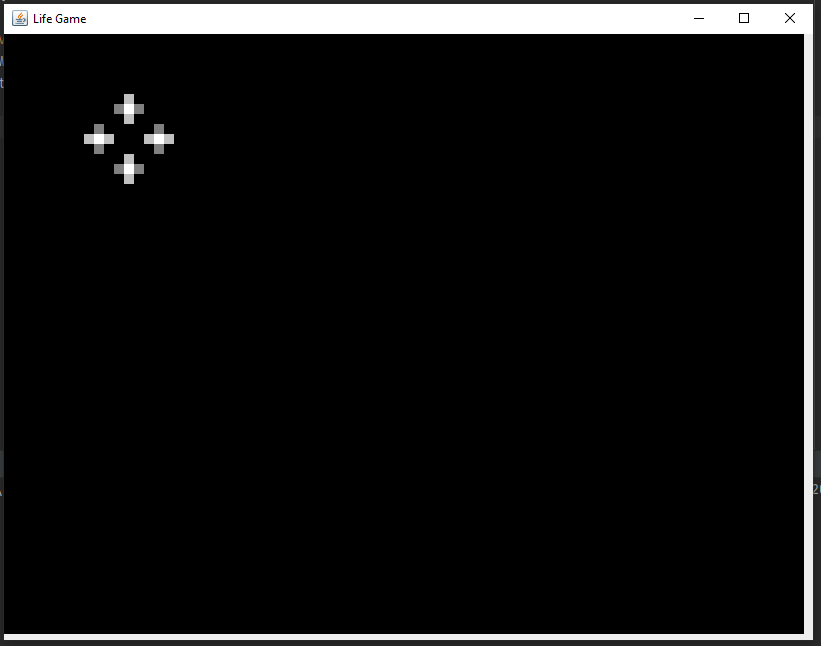

## Игра жизнь

Kлеточный автомат, придуманный английским математиком Джоном Конвеем в 1970 году.

**Правила**

- Место действия игры - клеточноe поле, которое, традиционно, называется «вселенная».
- Каждая клетка может быть живой или мёртвой.
- Поколения сменяются синхронно по простым правилам:
    - в пустой (мёртвой) клетке, рядом с которой ровно три живые клетки, зарождается жизнь;
    - если у живой клетки есть две или три живые соседки, то эта клетка продолжает жить; в противном случае (если соседей меньше двух или больше трёх) клетка умирает («от одиночества» или «от перенаселённости»).
- Игрок не принимает активного участия в игре. Он лишь расставляет или генерирует начальную конфигурацию «живых» клеток, которые затем изменяются согласно правилам. Несмотря на простоту правил, в игре может возникать огромное разнообразие форм.

Больше деталей можно посмотреть на [Википедии](https://ru.wikipedia.org/wiki/%D0%98%D0%B3%D1%80%D0%B0_%C2%AB%D0%96%D0%B8%D0%B7%D0%BD%D1%8C%C2%BB).

**Скриншоты**

В данной реализации игры на старте появляется следующее окно:

Такая фигура просто мигает на одном месте и не сдвигается, что бы запустить "жизнь" нужно добавить новые клетки.
Так как добавлять по одной клетке неинтересно, то щелчок будет добавлять фигуры, аналогичные мигающей на старте.
Путем добавления клеток можно достичь, например, такой анимации:

Писалось по обучающему [видео Евгения Волосатова](https://www.youtube.com/watch?v=3bOc7Z7K-GY) в целях общего знакомства с технологиями Java Swing.

